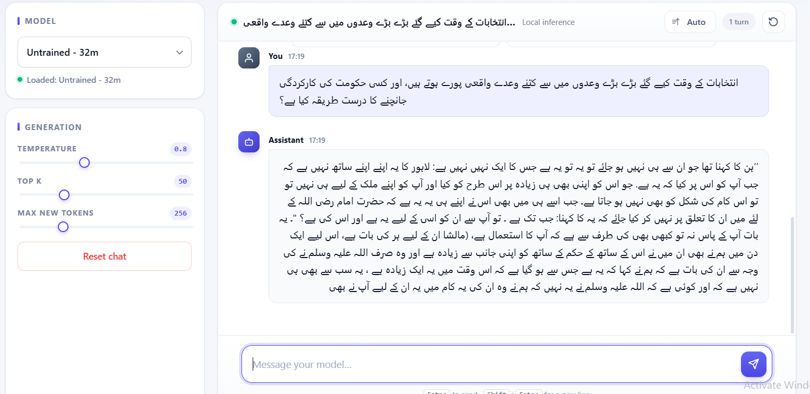
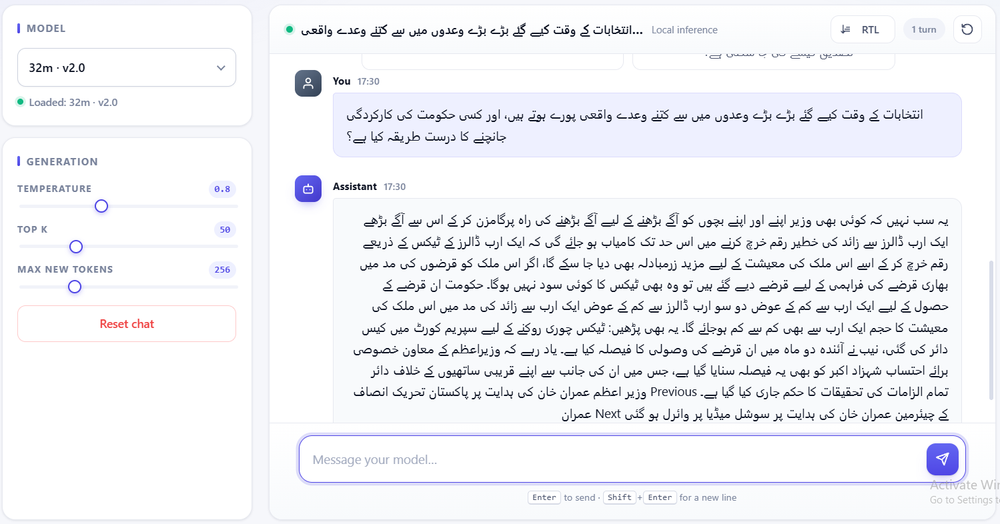

# LLM from Scratch — Hindi & Urdu

A GPT-style decoder-only language model built and trained from scratch in PyTorch for **Hindi and Urdu**, with **no English training data**.

This project was built to understand how modern language models work at the implementation level — from tokenization and embeddings to self-attention, transformer blocks, training, optimization, and autoregressive generation.

## Overview

The project includes custom implementations of:

* GPT-style decoder-only Transformer architecture
* Multi-head self-attention
* Feed-forward / MLP layers
* Token and positional embeddings
* Transformer blocks
* Custom tokenizer
* Training and validation pipeline
* Optimizer and learning-rate scheduling
* Distributed / multi-GPU training support
* Checkpointing and model loading
* Autoregressive text generation
* Temperature and Top-K sampling

Two model sizes were trained during the project:

| Model | Parameters | Languages    |
| ----- | ---------: | ------------ |
| Small |       ~32M | Hindi + Urdu |
| Large |      ~124M | Hindi + Urdu |

## Architecture

The model follows the standard decoder-only Transformer architecture used by GPT-style language models:

```text
Input Text
    │
    ▼
Tokenizer
    │
    ▼
Token IDs
    │
    ▼
Token Embeddings + Positional Embeddings
    │
    ▼
┌─────────────────────────────┐
│      Transformer Block      │
│                             │
│  Multi-Head Self-Attention  │
│             │               │
│          MLP / FFN          │
│             │               │
│        Residual Paths       │
│             │               │
│     Layer Normalization     │
└─────────────────────────────┘
              │
              ▼
          ... Blocks
              │
              ▼
       Language Model Head
              │
              ▼
        Token Probabilities
              │
              ▼
       Autoregressive Output
```

The token embedding and language-model head use tied weights.

## Tokenization

The models use a custom **SentencePiece-based tokenizer** designed for Hindi and Urdu text.

The primary vocabulary configuration uses approximately **32K tokens**.

The tokenizer was trained specifically for the target languages rather than using an English-oriented pretrained tokenizer.

## Training Data

The training corpus consists of Hindi and Urdu text.

The project intentionally excludes English training data.

The goal was not to build a general multilingual model, but to experiment with training a language model focused specifically on these two languages.

## Training

The training pipeline was implemented in PyTorch and includes:

* Custom dataset and dataloader
* Batched sequence training
* Gradient clipping
* Weight decay
* Learning-rate warmup
* Learning-rate scheduling
* Checkpoint saving
* Metric tracking
* Distributed Data Parallel (DDP) support

Training was performed on NVIDIA GPUs using CUDA.

## Generation

The trained models can be loaded from checkpoints and used for autoregressive generation.

Example:

```python
model = ModelLoader.load_final("path/to/final_model.pt")

generator = Generator(model)

output = generator.generate(
    prompt="ایک زمانے کی بات ہے",
    max_new_tokens=100,
    top_k=50,
    temperature=0.8,
)
```

Generation supports sampling controls such as:

* `temperature`
* `top_k`
* maximum generated tokens

## Why Build It From Scratch?

The purpose of this project was not simply to train a model that generates text.

It was to understand what actually happens inside a language model.

Instead of treating a Transformer as a black box, the project implements and explores the individual components that transform token IDs into probability distributions over the vocabulary.

This includes understanding how:

* tokens become vectors,
* vectors interact through attention,
* information moves through transformer layers,
* parameters are updated through backpropagation,
* gradients affect model weights,
* and the model eventually learns to predict the next token.

## Experiments

The project was developed alongside experiments involving:

* Different vocabulary sizes
* Different model sizes
* Hindi-only and Urdu-only data
* Hindi + Urdu combined training
* Sequence lengths
* Sampling strategies
* Parameter and layer visualization
* Model checkpoint inspection
* GPU inference

## Hardware / Software

### Software

* Python
* PyTorch
* CUDA
* SentencePiece

### Hardware

Training and experimentation were performed on NVIDIA GPUs.


## Generation (Samples)

### 32 million - untrained



### 32 million - after 10000 training steps (1.024 billion tokens processed)

